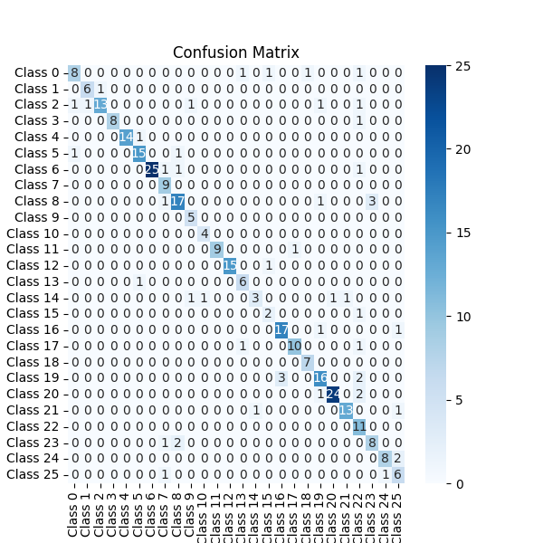

## Audio Classification

---

- Audio Classification with Conv 1D

### Preprocessing data:

- 1 - Join similar audio.
- 2 - Remove silence.
- 3 - Split audio.

### Model:

- 1 - Use 5 Layer Convolution.
- 2 - Use 2 Layer fully connected.
- 3 - Use AdamW optimizer with lr: 1e-3.
- 4 - Data have 27 different class.

### Test and results:

- Model evaluate with validation and test data.

| Data       | Loss   | Accuracy |
|------------|--------|----------|
| Train      | 0.2888 | 0.9139   |       
| Validation | 0.5731 | 0.8571   |       
| Test       | 0.5232 | 0.84     |       

